<div align="center">

# Blackbox

<br />


<br />

**Air-Gapped Update Distribution System**  
Signed package management for offline environments. Verify, approve, and install firmware and software bundles with ECDSA crypto, vendor trust store, dependency policies, and a tamper-evident audit chain.

</div>

---

## Overview

`blackbox` is a CLI tool for managing the lifecycle of signed software packages in air-gapped (offline/isolated) networks. It provides an end-to-end workflow:

1. **Build environment** (connected): generate ECDSA P-256 keys, create signed `.agpkg` bundles with embedded SBOMs
2. **Physical transfer** (USB / optical disc): carry the bundle across the air gap
3. **Target environment** (offline): verify, approve, and install with rollback protection and policy enforcement

All trust is rooted in a local database — vendor public keys are pre-loaded by an operator, never passed as a flag. Every operation is logged to a SQLite audit chain that cryptographically links each event to the previous one, making tampering detectable.

---

## Table of Contents

- [Architecture](#architecture)
- [System Requirements](#system-requirements)
- [Quick Start](#quick-start)
- [Build](#build)
- [Install](#install)
- [CLI Usage](#cli-usage)
- [Example Walkthrough](#example-walkthrough)
- [Package Format](#package-format)

---

## Architecture

```mermaid
flowchart LR
    subgraph BuildEnv["Build Environment (connected)"]
        direction TB
        Keygen["Key Generation<br/><small>ECDSA P-256</small>"]
        Builder["Package Builder"]
        Signer["Package Signer"]
        Keygen --> Builder
        Builder --> Signer
    end

    Transfer["Physical Transfer<br/><small>USB / optical disc</small>"]

    subgraph TargetEnv["Target Environment (air-gapped)"]
        direction TB
        CLI["CLI"]
        Trust["Vendor Trust Store<br/><small>pre-loaded public keys</small>"]

        subgraph Verify["Verifier"]
            SigCheck["Signature Check<br/><small>iterates trusted vendors</small>"]
            HashCheck["Payload + SBOM Hash Check"]
            ExpiryCheck["Metadata Expiry Check"]
            RollbackCheck["Rollback Guard<br/><small>version comparison</small>"]
            PolicyCheck["Policy Check<br/><small>blocked dependencies</small>"]
            StatusGate["Approval Gate<br/><small>pending -> approved</small>"]
        end

        DBs["Local Store<br/><small>SQLite</small>"]
        Audit["Audit Log<br/><small>Tamper-evident chain</small>"]
        Installer["Installer<br/><small>atomic transaction</small>"]

        Trust --> SigCheck
        CLI --> SigCheck
        SigCheck --> HashCheck
        HashCheck --> ExpiryCheck
        ExpiryCheck --> RollbackCheck
        RollbackCheck --> PolicyCheck
        PolicyCheck --> StatusGate
        StatusGate --> DBs
        StatusGate --> Audit
        StatusGate --> Installer
        Installer --> DBs
        Installer --> Audit
    end

    Signer -- ".agpkg + .sig" --> Transfer
    Transfer --> CLI
```



### Verification checks

| Check             | What it does                                            |
|-------------------|----------------------------------------------------------|
| **Signature**     | ECDSA P-256 signature matched against trusted vendor keys |
| **Payload hash**  | SHA-256 of every file in the payload directory           |
| **SBOM hash**     | SHA-256 of the embedded SPDX SBOM                        |
| **Metadata expiry** | Rejects packages past their `expires_at` date          |
| **Rollback**      | Blocks installation of versions older than current       |
| **Dependencies**  | Blocks import when a dependency is in the blocked list   |
| **Approval**      | Blocks install until operator explicitly approves        |

---

## System Requirements

**Build dependencies:**

| Package       | Minimum version | Purpose                   |
|---------------|-----------------|---------------------------|
| CMake         | 3.16            | Build system              |
| Ninja         | any             | Fast parallel builds      |
| libarchive    | 3.7             | `.agpkg` archive handling |
| OpenSSL       | 3.0 / 1.1       | ECDSA crypto + hashing    |
| SQLite3       | 3.45            | Local database            |
| Google Test   | 1.14            | Test framework (optional) |

Google Test will be auto-downloaded via git if not found on the system.

**Supported platforms:**

- Windows (MSYS2 / MinGW)
- WSL (Ubuntu)
- Native Linux (Ubuntu, Debian)

---

## Quick Start

```sh
make run
```

Builds the tool and runs a full workflow: key generation → package creation → signing → trust setup → import → approval → install → status check.

---

## Build

```sh
make
```

Or step by step:

```sh
cmake -B build -G Ninja
cmake --build build
```

### Ubuntu / WSL

```sh
sudo apt install cmake ninja-build libarchive-dev libssl-dev libsqlite3-dev libgtest-dev
make
```

### Windows (MSYS2/MinGW)

```sh
pacman -S mingw-w64-ucrt-x86_64-{cmake,ninja,libarchive,openssl,sqlite3,gtest}
make
```

### Run tests

```sh
make test          # or: cd build && ctest --output-on-failure
```

---

## Install

```sh
make install                      # installs to /usr/local/bin
make install PREFIX=/opt/blackbox # custom prefix
make install DESTDIR=/tmp/stage   # staged install for packaging
```

On Windows (MSYS2/MinGW), the default prefix `/usr/local` maps to `C:\msys64\usr\local`. To install system-wide outside MSYS2:

```sh
make install PREFIX=/c/Users/me/bin
```

The `blackbox` binary is copied to `$(PREFIX)/bin/`. Ensure that directory is in your `PATH`.

---

## CLI Usage

### Key management

```sh
blackbox keygen --out <dir>
```

Generates an ECDSA P-256 key pair. Output: `release.key` (private) and `release.key.pub` (public).

### Package operations

```sh
blackbox package create --name <name> --version <ver> \
    --payload <path> --sbom <path> --out <output>

blackbox package sign <pkg> --key <private_key>
```

`package create` bundles a payload directory and an SPDX SBOM into a `.agpkg` gzipped tar archive with a JSON manifest. `package sign` creates a `<pkg>.sig` file (raw ECDSA P-256 signature).

### Trust management

```sh
blackbox trust add <pub_key> --name <vendor>
blackbox trust list
blackbox trust remove --name <vendor>
```

Vendor public keys are stored in the local database. The `trust add` command shows a SHA-256 fingerprint — verify this out-of-band (compare against the vendor's website, documentation, or signed email) before trusting.

### Import / Approve / Install

```sh
blackbox import <pkg>
blackbox approve <name> --version <ver>
blackbox install <name> --version <ver>
```

`import` verifies the package signature against all trusted vendor keys, checks payload hash, SBOM hash, expiry, and blocked dependencies. If no trusted vendor key matches, import fails.

`approve` transitions a bundle from `pending` to `approved`. `install` applies the approved bundle atomically and blocks downgrades.

### Policy (dependency blocking)

```sh
blackbox policy block <name> <version> --reason <text>
blackbox policy unblock <name> <version>
blackbox policy list
```

Block known-vulnerable dependencies. Any import referencing a blocked package+version combination is rejected.

### Status & Audit

```sh
blackbox status
blackbox audit verify-chain
```

`status` lists installed packages and imported bundles. `audit verify-chain` cryptographically verifies every audit event links to the previous one, detecting tampering.

---

## Example Walkthrough

```sh
$ blackbox keygen --out keys
Generated key pair:
  Private: keys/release.key
  Public:  keys/release.key.pub

$ blackbox package create \
    --name ics-firmware-v2 --version 2.3.1 \
    --payload test_payload --sbom test_sbom.json \
    --out dist/ics-firmware-v2-2.3.1.agpkg
Package created: dist/ics-firmware-v2-2.3.1.agpkg
  Package:      ics-firmware-v2 2.3.1
  Payload hash: sha256:2cdcd0ad4502429092a8feb85527aa17ec639cb687373567a7fad14cdbedb1f9
  SBOM hash:    sha256:3fd5535252ca51a62de1b0a672c98a4c830eccb5732f44b3dbaa5c730f4244cc

$ blackbox package sign dist/ics-firmware-v2-2.3.1.agpkg --key keys/release.key
Signature: dist/ics-firmware-v2-2.3.1.agpkg.sig

$ blackbox trust add keys/release.key.pub --name "Internal Dev"
Trusted vendor added: Internal Dev
  Fingerprint: d9d675e32c65068d876d42aaf424e686467ec21aa6174a34507843ea247296cf
  (verify this fingerprint with the vendor out-of-band)

$ blackbox import dist/ics-firmware-v2-2.3.1.agpkg

  Signature    ✓ valid (Internal Dev)
  Bundle       ics-firmware-v2 2.3.1
  Payload hash ✓ valid
  SBOM         ✓ present
  SBOM hash    ✓ valid
  Expiry       ✓ valid
  Rollback     ✓ passed
  Dependencies ✓ all clear

  ✓ Status: imported and pending approval
Audit: AUDIT-6174f3

$ blackbox approve ics-firmware-v2 --version 2.3.1
Approved: ics-firmware-v2 2.3.1
Audit: AUDIT-b2f3f9

$ blackbox install ics-firmware-v2 --version 2.3.1
Installed: ics-firmware-v2 2.3.1
Audit: AUDIT-7332b1

$ blackbox status
Installed packages:
  ics-firmware-v2 2.3.1 (installed 2026-06-28 06:59:29)

Imported bundles:
  ics-firmware-v2 2.3.1 [approved] (imported 2026-06-28 06:59:29)

$ blackbox trust list
Trusted vendors:
  Internal Dev
    Fingerprint: d9d675e32c65068d876d42aaf424e686467ec21aa6174a34507843ea247296cf
    Added:       2026-06-28 06:59:29

$ blackbox audit verify-chain
Audit chain   ✓ valid
Events        6
```

---

## Package Format

A `.agpkg` file is a gzipped tar archive containing:

```
payload/                  # application files (any content)
  ...
metadata/
  manifest.json           # package metadata (JSON)
  sbom.spdx.json          # SPDX Software Bill of Materials
```

### Manifest fields

| Field                     | Description                                |
|---------------------------|--------------------------------------------|
| `package_name`            | Name of the package                        |
| `version`                 | SemVer version string                      |
| `build_id`                | ISO 8601 timestamp of build time           |
| `target_os`               | Target operating system (default: linux)   |
| `target_arch`             | Target architecture (default: x86_64)      |
| `payload_hash`            | `sha256:` prefixed hash of payload tree    |
| `sbom_hash`               | `sha256:` prefixed hash of the SBOM        |
| `minimum_allowed_version` | Minimum installable version (default: 0.0.0) |
| `requires_reboot`         | Whether a reboot is needed after install   |
| `dependencies`            | List of `{ name, version }` pairs          |
| `created_by`              | Tool that created the package              |
| `expires_at`              | ISO 8601 expiry timestamp (default: +90d)  |

Signatures are stored alongside as `<package>.agpkg.sig` (raw ECDSA P-256 signature).

---

## Configuration

`blackbox` uses a local SQLite database (`airgap.db`) for package state, trust store, audit log, and policy rules. The database path is currently hardcoded to `airgap.db` in the working directory. Future versions will support a configurable path via environment variable or config file.

No other configuration files are required.
