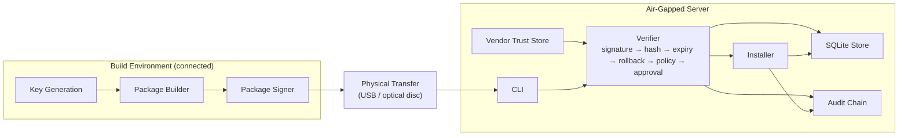
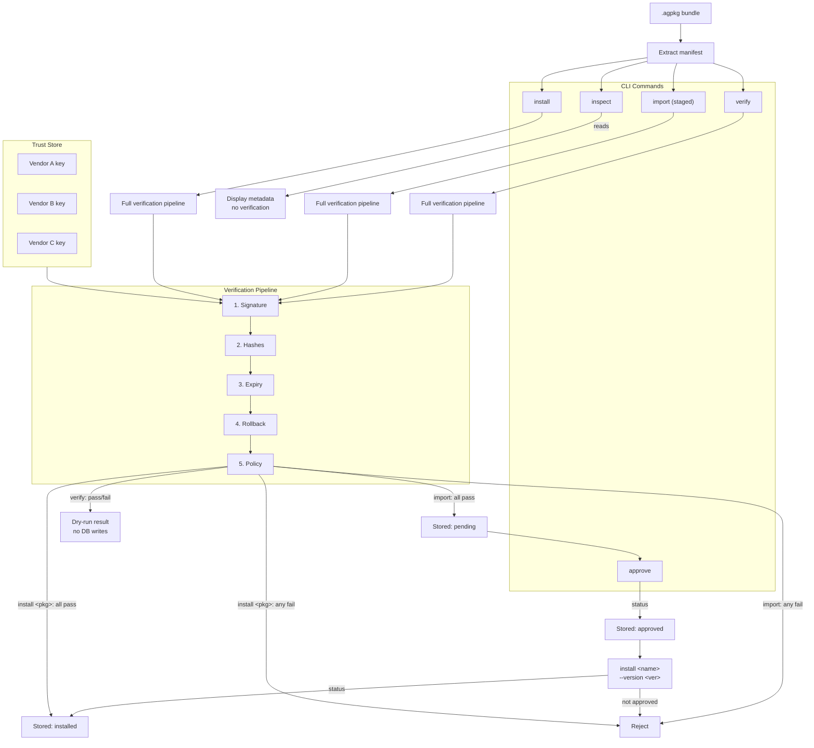

<div align="center">

# Blackbox

<br />


<br />

**Air-Gapped Update Distribution System**  
Signed package management for offline environments. Verify, approve, and install firmware and software bundles with ECDSA crypto, vendor trust store, dependency policies, and a tamper-evident audit chain.

</div>

---

## Overview

`blackbox` is a CLI tool for managing signed software packages across air-gapped networks. It handles the full lifecycle:

1. **Build environment** (connected): generate ECDSA P-256 keys, create signed `.agpkg` bundles with embedded SBOMs
2. **Physical transfer** (USB / optical disc): carry the bundle across the air gap
3. **Target environment** (offline): verify, approve, and install with rollback protection and policy enforcement

Trust lives in a local database. Vendor public keys get pre-loaded by an operator, never passed as a flag. Every operation goes into a SQLite audit chain that cryptographically links each entry to the last, so tampering shows up straight away.

---

## Table of Contents

- [Architecture](#architecture)
- [System Requirements](#system-requirements)
- [Quick Start](#quick-start)
- [Build](#build)
- [Install](#install)
- [CLI Usage](#cli-usage)
- [Example Walkthrough](#example-walkthrough)
- [Package Format](#package-format)

---

## Architecture



### Verification flow



### Verification checks

| Check             | What it does                                            |
|-------------------|----------------------------------------------------------|
| **Signature**     | ECDSA P-256 signature matched against trusted vendor keys |
| **Payload hash**  | SHA-256 of every file in the payload directory           |
| **SBOM hash**     | SHA-256 of the embedded SPDX SBOM                        |
| **Metadata expiry** | Rejects packages past their `expires_at` date          |
| **Rollback**      | Blocks installation of versions older than current       |
| **Dependencies**  | Blocks import when a dependency is in the blocked list   |
| **Approval**      | Blocks install until operator explicitly approves        |

---

## System Requirements

**Build dependencies:**

| Requirement | Version | Notes |
|-------------|---------|-------|
| Go          | 1.22+   | Single binary, no runtime deps |

**Supported platforms:**

- Windows (native, no MSYS2 needed)
- Linux (any distro)
- macOS
- Any architecture via `GOOS`/`GOARCH` cross-compile

---

## Quick Start

On the **air-gapped server**, you only need two commands:

```sh
blackbox trust add vendor.pub --name "Vendor Name"
blackbox install firmware.agpkg
```

That's it. The `install` command verifies the signature against trusted vendors, checks hashes, expiry, rollback, and policies, then records it as installed. All in one step.

*(On the connected build machine, see [Build](#build) and the [Example Walkthrough](#example-walkthrough) for creating and signing packages.)*

## Build

```sh
make
```
### Run tests
```sh
make test          # or: go test ./... -v
```
### Cross-compile
```sh
GOOS=linux GOARCH=arm64 go build -o blackbox .
GOOS=windows GOARCH=amd64 go build -o blackbox.exe .
```

## Install

```sh
make install
```

---

## CLI Usage

### Key management

```sh
blackbox keygen --out <dir>
```

Generates an ECDSA P-256 key pair. Output: `release.key` (private) and `release.key.pub` (public).

### Package operations

```sh
blackbox package create --name <name> --version <ver> \
    --payload <path> --sbom <path> --out <output>

blackbox package sign <pkg> --key <private_key>
```

`package create` bundles a payload directory and an SPDX SBOM into a `.agpkg` gzipped tar archive with a JSON manifest. `package sign` creates a `<pkg>.sig` file (raw ECDSA P-256 signature).

### Trust management

```sh
blackbox trust add <pub_key> --name <vendor>
blackbox trust list
blackbox trust remove --name <vendor>
```

Vendor public keys live in the local database. `trust add` prints a SHA-256 fingerprint. Verify this out-of-band (check against the vendor's website, docs, or a signed email) before you trust it.

### Package subcommands

```sh
blackbox package inspect <pkg>
blackbox package verify <pkg>
blackbox package import <pkg>
blackbox package install <pkg>
blackbox package install <name> --version <ver>
```

`package inspect` reads the `.agpkg` manifest and shows all fields (name, version, hashes, expiry, dependencies).

`package verify` runs the full verification pipeline (signature against trusted vendors, payload/SBOM hashes, expiry, rollback, dependency policy) as a dry run. No database writes, no audit events.

`package import` verifies the package and, on success, writes it to the local store with `pending` status. Use `approve` then `install` to finish.

`package install <pkg>` runs the whole workflow in one step: verify, import (as approved), and record the install. This is the normal way to install a package. The `<name> --version <ver>` form installs a bundle that was already imported via `import` + `approve`.

### Approve (staged workflow only)

```sh
blackbox approve <name> --version <ver>
```

Moves a bundle from `pending` to `approved`. Only needed if you imported separately instead of using `install <pkg>`.

**Legacy aliases:** `blackbox import` and `blackbox install <pkg>` still work.

### Policy (dependency blocking)

```sh
blackbox policy block <name> <version> --reason <text>
blackbox policy unblock <name> <version>
blackbox policy list
```

Block known-vulnerable dependencies. Any import referencing a blocked package+version combo gets rejected.

### Status & Audit

```sh
blackbox status
blackbox audit verify-chain
blackbox db verify
```

`status` lists installed packages and imported bundles. `audit verify-chain` cryptographically checks every audit event links to the one before it. `db verify` checks the audit chain and compares the current table state against the last recorded audit hash.

---

## Example Walkthrough

```sh
$ blackbox keygen --out keys
Generated key pair:
  Private: keys/release.key
  Public:  keys/release.key.pub

$ blackbox package create \
    --name ics-firmware-v2 --version 2.3.1 \
    --payload test_payload --sbom test_sbom.json \
    --out dist/ics-firmware-v2-2.3.1.agpkg
Package created: dist/ics-firmware-v2-2.3.1.agpkg
  Package:      ics-firmware-v2 2.3.1
  Payload hash: sha256:9d5b9601133cc61b64591bb9f8adb9787f74600f84b1cf0ad5029aef20e53705
  SBOM hash:    sha256:3fd5535252ca51a62de1b0a672c98a4c830eccb5732f44b3dbaa5c730f4244cc

$ blackbox package sign dist/ics-firmware-v2-2.3.1.agpkg --key keys/release.key
Signature: dist/ics-firmware-v2-2.3.1.agpkg.sig

$ blackbox trust add keys/release.key.pub --name "Internal Dev"
Trusted vendor added: Internal Dev
  Fingerprint: 10665c8e26104588cb57b557d351c4db004a5790c34dcd2299fd9be21113eb52
  (verify this fingerprint with the vendor out-of-band)

$ blackbox package inspect dist/ics-firmware-v2-2.3.1.agpkg
╭──────────────────┬──────────────────────────────────────────────────╮
│ FIELD            │ VALUE                                           │
├──────────────────┼──────────────────────────────────────────────────┤
│ Package          │ ics-firmware-v2                                 │
│ Version          │ 2.3.1                                           │
│ Payload Hash     │ sha256:9d5b9601133cc61b64591bb9f8adb9787f74... │
│ SBOM Hash        │ sha256:3fd5535252ca51a62de1b0a672c98a4c830e... │
│ Expires At       │ 2026-09-26T11:18:09Z                            │
│ Dependencies     │                                                 │
╰──────────────────┴──────────────────────────────────────────────────╯

$ blackbox package verify dist/ics-firmware-v2-2.3.1.agpkg
╭──────────────┬──────────────────┬─────────────────────╮
│ CHECK        │ RESULT           │ DETAIL              │
├──────────────┼──────────────────┼─────────────────────┤
│ Signature    │ ✓ valid          │ (Internal Dev)      │
│ Bundle       │                  │ ics-firmware-v2 2.3.1 │
│ Payload hash │ ✓ valid          │                     │
│ SBOM         │ ✓ present        │                     │
│ SBOM hash    │ ✓ valid          │                     │
│ Expiry       │ ✓ valid          │                     │
│ Rollback     │ ✓ passed         │                     │
│ Dependencies │ ✓ all clear      │                     │
╰──────────────┴──────────────────┴─────────────────────╯
  ✓ Status: verification passed

$ blackbox install dist/ics-firmware-v2-2.3.1.agpkg
╭──────────────┬─────────────┬───────────────────────╮
│ CHECK        │ RESULT      │ DETAIL                │
├──────────────┼─────────────┼───────────────────────┤
│ Signature    │ ✓ valid     │ (Internal Dev)        │
│ Bundle       │             │ ics-firmware-v2 2.3.1 │
│ Payload hash │ ✓ valid     │                       │
│ SBOM         │ ✓ present   │                       │
│ SBOM hash    │ ✓ valid     │                       │
│ Expiry       │ ✓ valid     │                       │
│ Rollback     │ ✓ passed    │                       │
│ Dependencies │ ✓ all clear │                       │
╰──────────────┴─────────────┴───────────────────────╯

Installed: ics-firmware-v2 2.3.1
Audit: AUDIT-6e3aec2

$ blackbox status
Installed packages:
  ics-firmware-v2 2.3.1 (installed 2026-06-28 12:33:07)

Imported bundles:
  ics-firmware-v2 2.3.1 [approved] (imported 2026-06-28 12:33:07)

$ blackbox trust list
Trusted vendors:
   Internal Dev
    Fingerprint: 10665c8e26104588cb57b557d351c4db004a5790c34dcd2299fd9be21113eb52
    Added:       2026-06-28 11:18:09

$ blackbox audit verify-chain
Audit chain   ✓ valid
Events        3
```

---

## Package Format

A `.agpkg` file is a gzipped tar archive containing:

```
payload/                  # application files (any content)
  ...
metadata/
  manifest.json           # package metadata (JSON)
  sbom.spdx.json          # SPDX Software Bill of Materials
```

### Manifest fields

| Field                     | Description                                |
|---------------------------|--------------------------------------------|
| `package_name`            | Name of the package                        |
| `version`                 | SemVer version string                      |
| `build_id`                | ISO 8601 timestamp of build time           |
| `target_os`               | Target operating system (default: linux)   |
| `target_arch`             | Target architecture (default: x86_64)      |
| `payload_hash`            | `sha256:` prefixed hash of payload tree    |
| `sbom_hash`               | `sha256:` prefixed hash of the SBOM        |
| `minimum_allowed_version` | Minimum installable version (default: 0.0.0) |
| `requires_reboot`         | Whether a reboot is needed after install   |
| `dependencies`            | List of `{ name, version }` pairs          |
| `created_by`              | Tool that created the package              |
| `expires_at`              | ISO 8601 expiry timestamp (default: +90d)  |

Signatures are stored alongside as `<package>.agpkg.sig` (raw ECDSA P-256 signature).
